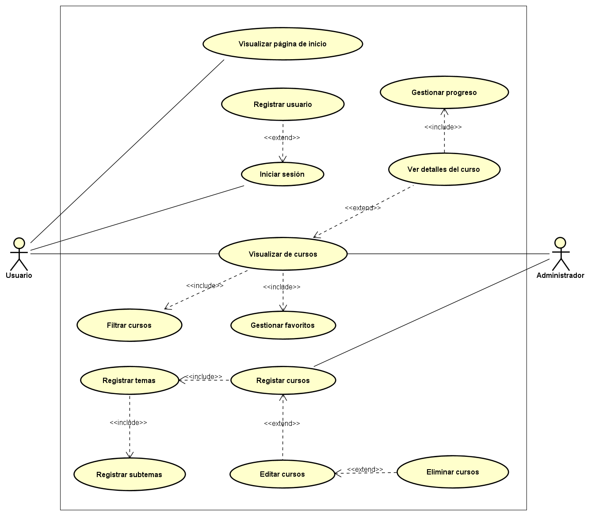
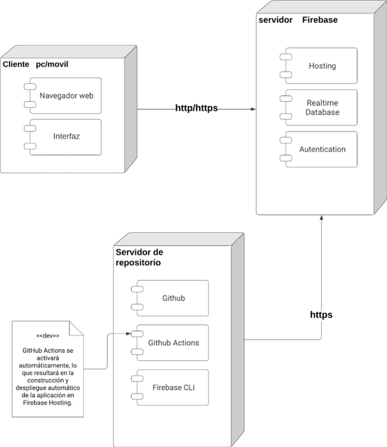

# Plataforma de cursos

## 📄 **Tabla de contenidos** 
- [Introducción](#introducción)
- [Objetivo del proyecto](#objetivo-del-proyecto)
- [Descripción del proyecto](#descripción-del-proyecto)
- [Requerimientos funcionales](#requerimientos-funcionales)
- [Diagrama de casos de uso](#diagrama-de-casos-de-uso)
- [Diagrama de despliegue](#diagrama-de-despliegue)
- [Vistas del proyecto](#vistas-del-proyecto)
- [Ejemplos del funcionamiento](#ejemplos-del-funcionamiento)
- [Conclusiones](#conclusiones)
- [Integrantes del equipo](#integrantes-del-equipo)

## **Introducción**
Este proyecto, como parte de la asignatura de Sistemas Distribuidos, se centró en la creación de una plataforma de cursos en línea. Mediante una arquitectura cliente-servidor y el uso de servicios web REST, se diseñó y desarrolló un sistema que permite a los usuarios registrarse, iniciar sesión, explorar y gestionar cursos de manera eficiente. Además, se implementaron funcionalidades para que los administradores puedan gestionar los contenidos de la plataforma.

## **Objetivo del proyecto**
El objetivo principal fue implementar una plataforma de aprendizaje en línea funcional y eficiente. A través de una arquitectura distribuida y servicios web REST, buscamos ofrecer una experiencia fluida tanto para estudiantes como administradores. Además, nos propusimos cumplir con los requisitos funcionales establecidos, garantizando la facilidad de uso del sistema tanto para usuarios como para administradores.

## **Descripción del proyecto**
Este proyecto se centra en el desarrollo de un sitio web de cursos, ofreciendo a los usuarios una plataforma interactiva para acceder a una amplia gama de recursos educativos. Los usuarios pueden registrarse fácilmente, explorar cursos por categoría, marcar cursos como favoritos y hacer un seguimiento de su progreso. Además, los administradores cuentan con herramientas para gestionar y administrar los cursos, desde la creación y edición hasta la publicación y eliminación, proporcionando una experiencia completa tanto para los estudiantes como para los encargados de la plataforma.

## **Requerimientos funcionales**
**Usuario:**  
- **RF001 - Página de inicio**  
  Al acceder al sitio web, el usuario debe ser dirigido a una página de inicio que contenga información relevante sobre el sitio web.
- **RF002 - Registro de usuario**  
Los usuarios deben poder registrarse en la plataforma de manera sencilla utilizando una dirección de correo electrónico y una contraseña.
- **RF003 - Inicio de sesión**  
Los usuarios deben poder iniciar sesión con su correo electrónico y contraseña registrados previamente.
- **RF004 - Visualización de cursos**  
Los usuarios deben poder explorar y visualizar todos los cursos disponibles en la plataforma mediante una vista por tarjetas que incluyen información como el nombre del curso, la categoría y una breve descripción.
- **RF005 - Detalles del curso**  
Los usuarios deben poder visualizar los bloques de contenido de cada curso, incluyendo videos y una descripción detallada del curso. 
- **RF006 - Filtrado de cursos**  
Los usuarios deben tener la opción de filtrar y clasificar los cursos según las categorías disponibles.    
*Requerimientos a futuro:*    
- **RF007 - Gestión de favoritos**  
Los usuarios podrán marcar cursos como "favoritos" y ver una lista de todos los cursos marcados como favoritos.
- **RF008 - Seguimiento de progreso del curso**  
Los usuarios deben poder ver tanto los cursos que han completado como su progreso actual en los cursos en los que están inscritos.  

**Administrador:**
- **RF009 - Visualización de cursos**  
El administrador debe contar con una vista general de todos los cursos.
- **RF010 - Filtrado de cursos**  
El administrador debe poder filtrar por cursos publicados y no publicados.
- **RF011 - Registro de cursos**  
El administrador debe poder crear cursos con un título, descripción, categoría, temas, subtemas y enlaces de los videos.
- **RF012 - Registro de temas**  
El administrador debe poder agregar temas, con un título y una descripción, para cada curso.
- **RF013 - Registro de subtemas**  
El administrador debe poder agregar subtemas, con un título y el enlace del video, para cada curso.    
*Requerimientos a futuro:*    
- **RF014 - Edición de cursos**  
El administrador debe poder editar toda la información relacionada a un curso. Se incluye, el título, descripción, temas, subtemas, enlaces de videos y el estado (publicado o no)..
- **RF015 - Eliminación de curso**  
El administrador debe poder eliminar un curso junto a toda su información.

## **Diagrama de casos de uso**

## **Diagrama de despliegue**

## **Vistas del proyecto**
El diseño de las vistas se encuentran [aquí](https://www.figma.com/design/oHhb8kshefPxBi7MTPIRpo/Plataforma-de-cursos?node-id=71%3A1352&t=ApY1BeBAcXTX7Tzi-1).

## **Ejemplos del funcionamiento**
- [Usuario](https://youtu.be/qr89ZFIuNkU)
- [Administrador](https://youtu.be/OPodlMqLglc)

## **Conclusiones**
Este proyecto representa el resultado de un esfuerzo conjunto para desarrollar una plataforma de aprendizaje en línea funcional. Utilizando una arquitectura cliente-servidor y servicios web REST, logramos implementar un sistema que cumple con los requerimientos establecidos.

Durante el desarrollo, enfrentamos desafíos técnicos que superamos mediante la planificación y la colaboración en equipo. Esta experiencia destacó la importancia de abordar de manera efectiva los obstáculos para garantizar el éxito del proyecto.

## **Integrantes del equipo**
- 👩‍💻[Lourdes Gabriela Batún Cemé](https://github.com/Gabriela-Batun-Ceme)
- 👨‍💻[Erik Alejandro Poot Sánchez](https://github.com/erikpsanchez)
- 👨‍💻[Carlos Fernando Sánchez Chuc](https://github.com/Charly-Sz18)
